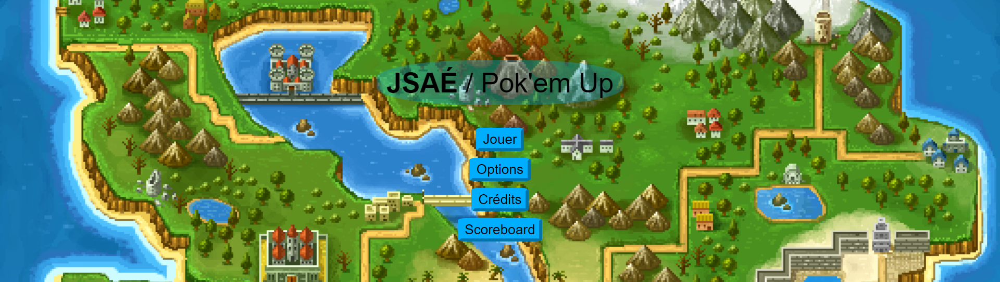

# Pok'em Up => Le Shoot'em Up pas du tout plagié d'une quelqu'license license Japonaise.



## Informations

### Participants
- Romain Degez
- Alexandre Martel
- Axel Saint-maxin

### [Le Sujet](./Sujet.md)

### Sommaire

[TOC]

## Diagrammes de séquence

## Difficulté techniques

### Serveur

L'installation du serveur a pris beaucoup de temps.\
Comprendre comment fonctionnent les transfèrent de données,\
que c'est le serveur qui stocke et envoient les données aux différentes vues.\
On a perdu du temps à passer ce que l'on avait programmé côté client vers le côté serveur.

### Les hitbox et collisions

Comment faire se rencontrer deux hits boxes, si on les faits bien\
c'est mettre à mal nos performances mais si on fait trop simpliste on risque de passer à travers l'ennemie.\
Détecter quels éléments est rentré en collision pour le supprimer lui et pas un autre.

### Gestion des joueurs

Chaque joueur doit posséder son identifiant, la manipulation de celui-ci doit ce faire sans altérer les autres\
La connexion et déconnexion ne doit pas avoir d'incident direct sur la partie\
(Par exemple : la connexion d'une personne au site ne doit pas relancer la partie)

### Restart et Arrêt de partie

Comment arrêter et relancer une partie ?\
Il faut le prendre en compte dès le débuts, surtout si on abuse des setInterval\
Le restart en particulier est difficile car on ne peut pas juste faire :
```js
new GameView()
```

### La résolution des bugs

Certaines erreurs ne sont pas affichées car elle ne provoque pas d'erreur directe,\
par exemple les undefined où Nan nous ont particulièrement posé problème

## Points d'amélioration et d'achèvement du projet

Avec plus de temps beaucoup de choses en plus auraient pu être accomplies :

- Plusieurs parties jouables simultanément
- Ajout d'une capacité de déplacement
- Évolution du personnage et de ses capacités
- Plusieurs niveaux
- Une transition pour changer l'orientation du jeu d'horizontale à vertical (la transition visuelle et faites mais pas implémentée)
- Plus de bonus
- Des ennemies qui tirent, bougent différemment
- Un sens ne tire pas seulement tout droit
- Des effets visuels et sonores (effet de vent, bruitage des ennemies toucher, dégâts reçus...)

## Ce dont vous êtes le plus fier/fière

|     Nom          |    Fierté                                                                                                   |
|------------------|-------------------------------------------------------------------------------------------------------------|
| Saint-maxin Axel | L'inertie (fait très vite et tous les groupes (5 différents) sont venue me voirent après pour des conseils) |
| Degez Romain     | Les Routes et le serveur qui fonctionne bien                                                                |
| Martel Alexandre | Les collisions                                                                                              |
